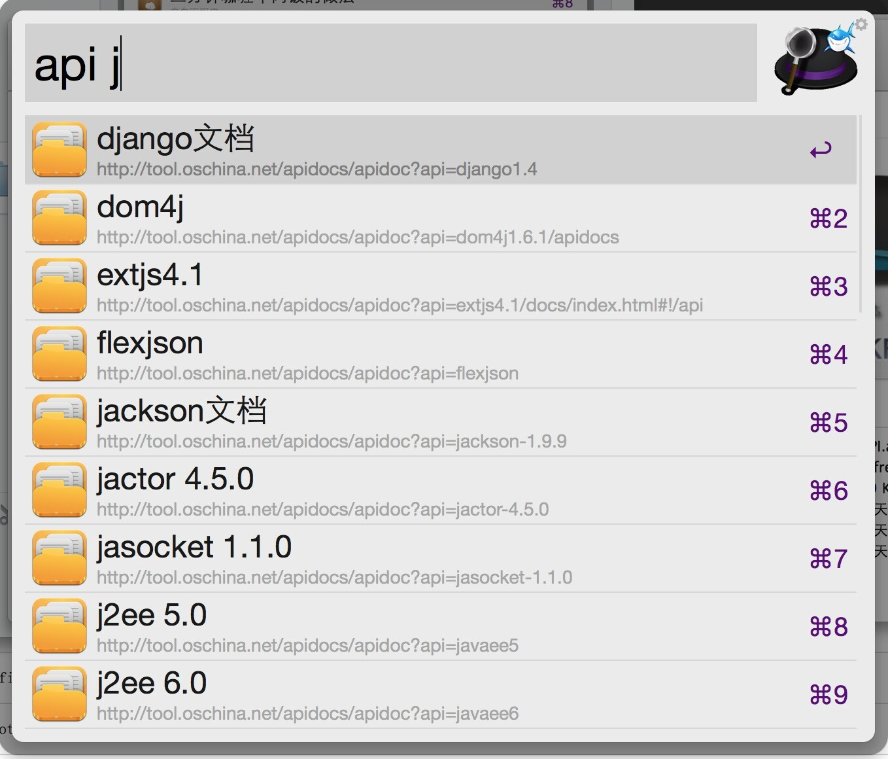

apis
========

For AlfredWorkFlow2 API在线文档搜索

##安装
[点我直接下载“API.workflows”](https://raw.githubusercontent.com/jShi-git/cookbook/master/download/%E8%8F%9C%E8%B0%B1.alfredworkflow)

##项目说明
1、输入关键字，搜索API
> Usage: api jquery

2、输入命令，更新API数据库
> Usage: apisync up

##TODO
- 添加更多的API数据

##运行效果

